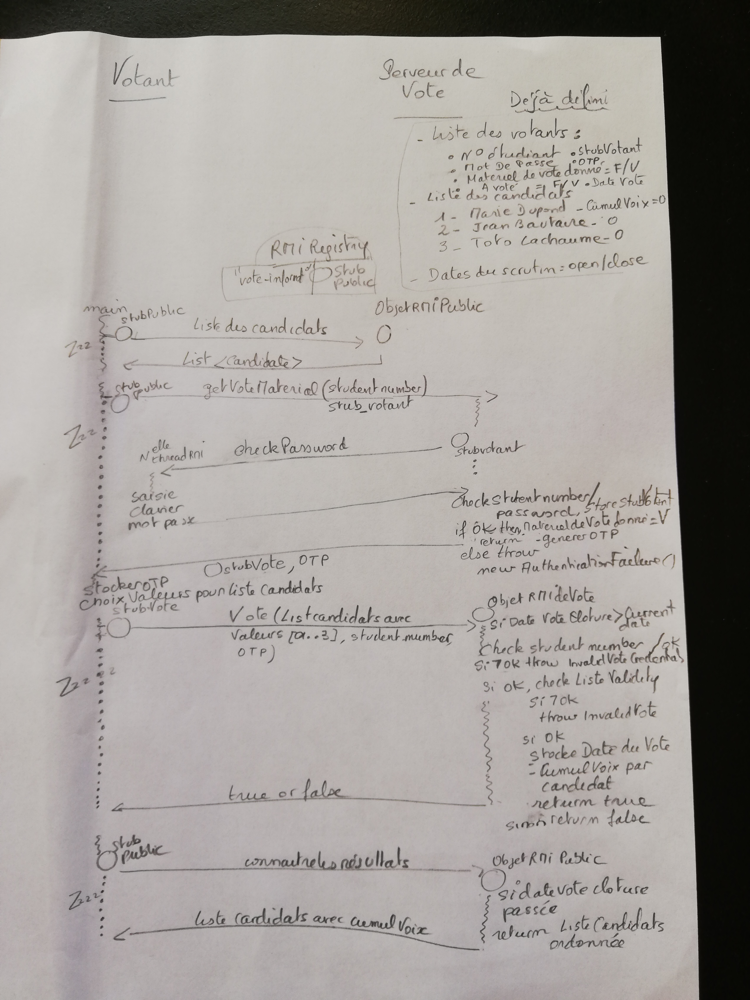

>This work must be carried out in pairs (en binôme), and both members must be in the same group.
>Target end date is 23h59 the day before next lab.
>One member of each pair must send, just below this page on the main course, one .zip archive containing:
>    * The source code
>    * A small report explaining the choices you made, the difficulties you met, and how to use the applications.
>The archive must contain the names of both students.

## Introduction

The goal of this lab is to develop using RMI:

* A server allowing users to vote electronically (eg. for their SI4 representative(s) !)
* A client that can communicate with the server and so doing allow its users to authentify themselves, retrieve the candidates list, and vote.

In each section, you may find multiple proposals for implementing a given feature; the hardest one and all the bonuses are mandatory if you want a perfect grade, but you can pass this assessment with a lesser grade by implementing an easier proposition.

## Features
### Candidates

A candidate is represented by:

* A rank (which can be considered as a unique id), starting at 1
* Its first and last names (as a unique string)
* [Optional] A pitch (text or video)

Note: You may need to subclass the class representing the candidates to allow different kind of pitches to be used (see polymorphism). Do not try to implement dynamic class loading from voters to get this subclass, because, SecurityManager is deprecated... and there is apparently no replacement from JDK20. https://snyk.io/fr/blog/securitymanager-removed-java/

### Users

A user is represented by:

* A student number
* A password

Note: You may replace the student number by any unique identifier if you want something more generic.

### Authentication

To simplify, we will avoid the creation of a sign-up process, so we need to consider that the authorized users are already known by the server. To do so, 2 possibilities:

* [Easy] Hardcode the users and candidates informations directly in the server.
* [Hard] Develop a Java application generating the necessary data structures to represent the candidates when the RMI server side is launched. This application could query the administrator of the vote to have him/her fill up the needed information and serialize the objects to obtain a file of objects if it doesn't exist already. Then have the server deserialize the file.

In any case, to authentify:

1. The client will provide its own stub as parameter of the method that send the voting material 
2. The server will in turn connect to the given client to request the credentials (which will be the returned value). 
3. If the credentials match, the server will send the stub containing the voting methods and a one-time password that the user will have to send when voting.

Note: to avoid having users vote multiple times, the voting material should be sent only once to each user. If the one-time password has already been used by a user, a specific exception must be triggered ("HasAlreadyVotedException" for instance in this case)

Note: globally, always raise specific exceptions in case of wrong behavior ("BadCredentialsException" if the authentication fails, ...).

Bonus: you can change the way the one-time password works so that the user can restart his/her vote. In this case, you need to ask for this password if a user tries to retrieve the voting material multiple times. Care must also be taken to ensure the cancelation the previous vote done by the same voter.

### Voting

We will adopt cardinal voting (vote par valeur). The value for each candidate should go from 0 to 3, and at the end of the vote the score of each candidate will be summed up and the one with the highest score wins.

For instance, let's say there are 4 candidates: Paul Dupont (rank 1); Emilie Durant (rank 2); Steph Fiat (rank 3); Marie Vivier (rank 4).
A vote can be (1, 2); (2, 0); (3, 3); (4, 3). That is, for candidate ranked 1, the preference is 2, etc ... If another voter submits (1,0) ; (2, 1) ; (3, 2); (4,0), and considering we have only two voters, the final result will be (1, 2); (2, 1); (3, 5); (4, 3), so candidate ranked 3, Steph Fiat, is the one elected. If a second candidate must be designated, as a deputy of the first, then the candidate number 4, Marie Vivier is also designated.

## Lifecycle
### Server start

When the server is launched:

* Retrieve the list of users and candidates if you developed the hard authentication.
* Set up the voting conditions: to do so, either the administrator (who launched the server) can type (in the server's console) the start and end dates, or the server can simply wait for a given key to start the vote and another key to stop it, or the vote can keep going until all users have voted, the choice is yours.

### Vote started

Once the vote has started, users (on the client):

* Query the list of candidates (and for each candidate his/her pitch if any) and print it
* Note: this should be done through a public stub (an RMI object stub also registered in the RMI registry)
* Get the voting material, which is a stub of another RMI object containing methods to vote (reminder: this implies authentication)
* Vote. You are free to implement the methods you want, but you must respect the voting conditions described above (particularly the fact that users can only vote once using their One Time Password).

Then the server will register the vote alongside the student number of the user (which has been passed with the OTP when invoking the vote method).

**Bonus**: for further logging and checks on how the whole voting process ran, you can store on the server additional information alongside the student number (date of the vote, name of the voter (by calling back a method on the client stub), ...).
Vote is over

When the vote is over (how/when it happens depends on the configuration at server start):

* The score of each candidate is available (it may have been computed / modified each time the vote took place by adding the scores to each candidate). 
* The results are printed at server side 
* They can also be retrieved at client side if needed

